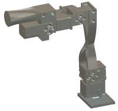
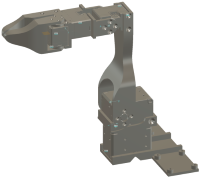

# 日志 Log

### 2024/5/19

* 完成大陆版主臂和从臂材料列表的核对和采购链接整理，通过对比京东和淘宝两个平台的材料，发现淘宝比较齐全并且价格最为便宜。目前看所有材料都可以在淘宝平台购买，主臂材料大概需要人民币1537元，从臂材料大概需要2014元。若从亚马逊购买，每项需要11美元左右的运费，会增加很多成本。另外除了进口的Dynamixel电机和附件外，其他材料在国内都有较大的价格优势。

### 2024/5/18

* 从GitHub克隆项目空间到本地 URL: https://github.com/AlexanderKoch-Koch/low_cost_robot
* 安装软件所需控件：pip install mujoco -i https://pypi.douban.com/simple
* 安装md 文件扩展：Todo MD
* 阅读研究项目文件：READ.md
* 建立工作目录: wj，并将此目录加入到 .gitignore文件的忽略更新列表中。
* 更新个人日志文件：worklog.md

# 硬件 Hardware

## 主臂Leader Arm



### 材料列表Required Materials


| 部件Part                                                        | Cost   | 购买链接Buying link（大陆版）                                                                                                                  | 规格说明Specs                                                                                            |
| --------------------------------------------------------------- | ------ | ---------------------------------------------------------------------------------------------------------------------------------------------- | -------------------------------------------------------------------------------------------------------- |
| 1. 6x Dynamixel XL330-M077<br /><br /><br /><br /><br /><br /> | ￥1290 | [https://item.taobao.com/item.htm?id=744329960663](https://item.taobao.com/item.htm?id=744329960663)                                           | ROBOTIS XL330-M077-T 单价人民215元，需要6套                                                             |
| 2. XL330 Frame                                                  | ￥95   | [https://item.taobao.com/item.htm?id=647142811144](https://item.taobao.com/item.htm?id=647142811144)                                           | ROBOTIS FPX330-S101 4pcs-set                                                                            |
| 3. XL330 Idler Wheel                                            | ￥100  | [https://item.taobao.com/item.htm?id=646782958666](https://item.taobao.com/item.htm?id=646782958666)                                           | ROBOTISFPX330-h101 4pcs-set                                                                              |
| 4. Waveshare Serial Bus Servo Driver Board                      | ￥24   | [https://item.taobao.com/item.htm?id=738955630278](https://item.taobao.com/item.htm?id=738955630278)                                           |                                                                                                          |
| 5. 5V Power Supply                                              | ￥11   | [https://item.taobao.com/item.htm?id=667744796993&skuId=4986955171356](https://item.taobao.com/item.htm?id=667744796993&skuId=4986955171356)   | 5V 2A 电源 10W 100-240V 交流/直流适配器,5V 2Amp 1500mA 1000mA 电源转换器,带 5.5mm x 2.5mm/2.1mm 直流插头 |
| 6. Table Clamp                                                  | ￥17   | [https://detail.tmall.com/item.htm?id=668120504241&skuId=4983853090357](https://detail.tmall.com/item.htm?id=668120504241&skuId=4983853090357) | C 形夹,3 英寸(约 7.6 厘米)，1200磅力                                                                     |
| Total                                                           | ￥1537 | （原网站是183美元，大约1323元，主要是进口运费贵了）                                                                                            |                                                                                                          |

## 从臂Follower Arm



### 材料列表Required Materials


| 部件Part                                   | Cost   | 购买链接Buying link（大陆版）                                                                                                                  | 规格说明Specs                                                                                                                                                       |
| ------------------------------------------ | ------ | ---------------------------------------------------------------------------------------------------------------------------------------------- | ------------------------------------------------------------------------------------------------------------------------------------------------------------------- |
| 1. 2x Dynamixel XL430-W250                | ￥896  | [https://item.taobao.com/item.htm?id=600743173349](https://item.taobao.com/item.htm?id=600743173349)                                           | ROBOTIS XL430-W250-T 单价人民448元，需要2套                                                                                                                         |
| 2. 4x Dynamixel XL330-M288                 | ￥860  | [https://item.taobao.com/item.htm?id=744569930213](https://item.taobao.com/item.htm?id=744569930213)                                           | ROBOTIS XL330-M288-T 单价人民215元，需要4套                                                                                                                        |
| 3. XL330 Idler Wheel                       | ￥100  | [https://item.taobao.com/item.htm?id=646782958666](https://item.taobao.com/item.htm?id=646782958666)                                           | ROBOTISFPX330-h101 4pcs-set                                                                                                                                         |
| 4. XL430 Idler Wheel                       | ￥75   | [https://item.taobao.com/item.htm?id=581922883001](https://item.taobao.com/item.htm?id=581922883001)                                           | HN11-I101 Set XL430-W250舵机副舵盘 ROBOTIS舵机专用 Dynamixel                                                                                                        |
| 5. Waveshare Serial Bus Servo Driver Board | ￥24   | [https://item.taobao.com/item.htm?id=738955630278](https://item.taobao.com/item.htm?id=738955630278)                                           |                                                                                                                                                                     |
| 6. Voltage Reducer x 6 pics                | ￥23   | [https://detail.tmall.com/item.htm?id=41307963557&skuId=3944784489256](https://detail.tmall.com/item.htm?id=41307963557&skuId=3944784489256)   | Queta 6 件 LM2596s 直流转直流降压器，单价3.79元人民币。输入:直流 3.2V 至 40V(输入电压必须比输出电压高1.5V)，输出:直流 1.25V 至 35V 连续可调电压,最大输出电流为 3A。 |
| 7. 12V Power Supply                       | ￥14   | [https://item.taobao.com/item.htm?id=608892359484&skuId=4444811319283](https://item.taobao.com/item.htm?id=608892359484&skuId=4444811319283)   | 12V 5A 电源适配器，输入:AC 100-240V，5.5mm x 2.5mm 和 2.1mm 输出插孔                                                                                                |
| 8. Table Clamp                             | ￥17   | [https://detail.tmall.com/item.htm?id=668120504241&skuId=4983853090357](https://detail.tmall.com/item.htm?id=668120504241&skuId=4983853090357) | C 形夹,3 英寸(约 7.6 厘米)，1200磅力                                                                                                                                |
| 9. Wires                                   | ￥5    | [https://item.taobao.com/item.htm?id=571492461591&sku_properties=-1:-5](https://item.taobao.com/item.htm?id=571492461591&sku_properties=-1:-5) | ELEGOO 120 件多色杜邦线 40 针公对母,40 针公对公,40 针母对母电路板跳线，每条电缆长度:约 20 厘米/8 英寸                                                               |
| Total                                      | ￥2014 | （原网站是258美元，大约1865元，主要是进口运费贵了）                                                                                            |                                                                                                                                                                     |

## 控制器Controller

## 传感器Sensor

## 装配Assembly

### 装配视频

[https://youtu.be/RckrXOEoWrk](https://youtu.be/RckrXOEoWrk)

### 零件3D打印

1. 使用3D打印机打印所有零件
   1.1. STL文件在`hardware/follower/STL中`
   1.2.  零件的设计便于打印；只有夹具的移动部分需要支撑
2. 扫描电机
   2.1. 将驱动板连接到计算机（应与Linux和MacOS一起使用）
   2.2. 找出设备名称（例如，适用于MacOS的tty.usbmodem57380045631）：``ls/dev/tty*```
3. 使用[Dynamixel向导]单独扫描每个电机   (https://emanual.robotis.com/docs/en/software/dynamixel/dynamixel_wizard2/)
   3.1. 将所有电机的波特率设置为1M
   3.2. 将肩部的伺服ID设置为1，将夹持器伺服设置为5（如果使用肘部到手腕的延伸，则为6）
   3.3. 装配
   3.3.1. 安装无底座的臂
   3.3.1.1. 确保伺服装置固定在与CAD中相同的位置
   3.3.1.2. 拧入时伺服喇叭应处于默认位置
   3.3.2. 将导线焊接到降压器上；输入应连接到阴连接器，输出应连接到阳连接器
   3.3.3. 将降压器和伺服驱动板拧到底座上
   3.3.4. 将底座拧到臂上
   3.3.5. 将驱动板上的D、V和G端口连接到肩部旋转伺服
   3.3.6. 将肩部旋转伺服装置连接到肩部提升伺服装置
   3.3.7. 将降压器的输入连接到驱动器板上的V和G端口
   3.3.8. 将降压器的输出和驱动器板的剩余D端口连接到弯管伺服
   3.3.9. 将驱动器板连接到电源
   3.3.10. 连接到XL330伺服，在Dynamixel Wizard上查看输入电压，然后调整降压器上的螺钉，直到输入电压为5V

# 软件Software

### 安装mujoco

pip install mujoco -i https://pypi.duoban.com/simple

### 安装dynamixel_sdk

pip install dynamixel-sdk

dynamixel_sdk`是 ROBOTIS 的 Dynamixel 系列的 SDK，用于控制 Dynamixel 驱动器。这个库不是在 PyPI 上公开可用的，所以不能通过`pip`直接安装。但是，你可以从 ROBOTIS 的 GitHub 仓库下载并安装。以下是安装`dynamixel_sdk` 的步骤：

1. 访问 ROBOTIS Dynamixel SDK 的 GitHub 仓库：[https://github.com/ROBOTIS-GIT/DynamixelSDK](https://github.com/ROBOTIS-GIT/DynamixelSDK)
2. 克隆或下载该仓库到你的本地机器。
3. 解压下载的文件，如果是克隆的话，进入对应的目录。
4. 根据你的操作系统，编译库。对于 Linux 系统，你可以运行 `build_linux.sh` 脚本；对于 Windows 系统，运行 `build_windows.bat` 批处理文件。
5. 编译完成后，将生成的库文件放入你的 Python 库路径中，或者将 SDK 目录链接到你的 Python 站点包。
6. 在 Python 中导入库并使用。

这是一个高层次的概述，具体的编译和安装步骤取决于你的操作系统和编译环境。如果你需要更具体的指导，请查看仓库中的 `README.md` 文件，或者 ROBOTIS 的官方文档。
